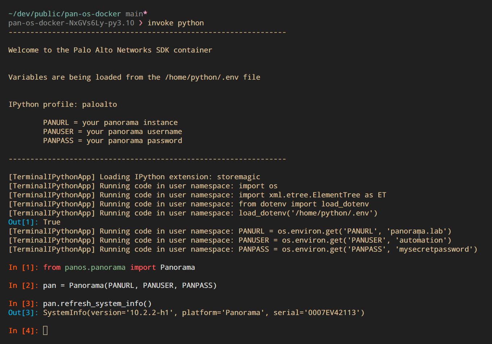

# pan-os-docker

[](https://www.paloaltonetworks.com/)

## `Overview`

The goal of this repository is to provide a Docker container for learning how to automate Palo Alto Networks products.

### Python

Python environment is provided by the `pan-os-docker:python` container tag. Using this container image will provide you with an interactive Python environment with the following additions:

- automatically load user variables from `./python/.env`
- Element Tree (from xml package) will be imported as ET
- all Python files stored within the [python](./python/) mounted at `/home/python`

### Ansible

All files related to Ansible are stored within the [ansible](./ansible/) directory at the root of this repository.

### Golang

All files related to Ansible are stored within the [golang](./golang/) directory at the root of this repository.

## ⚙️ `Building the containers`

After [ensuring that your environment is setup properly](./docs/environment.md), execute the build of your desired container with invoke.

### Building the Python container

(**optional**)
If you'd like to have your container auto-populated with your Palo Alto variables, your first task is to rename the `.env.example` file to `.env` within the Python directory, then update the file with the appropriate credientials.

```bash
mv python/.env.example python/.env
```

Build your Python container with the following invoke command:

```bash
invoke buildpython
```

Start your container and jump into the Python interpreter with:

```bash
invoke python
```



If you loaded your `.env` file with your credientials, you will find them loaded automatically as the following constants:

```conf
PANURL = your panorama instance
PANUSER = your panorama username
PANPASS = your panorama password
```

## 🚀 `Run the container images`

Here are the following options for running your container of choice:

- `invoke python`
- `invoke golang`
- `invoke ansible`
- `invoke terraform`

## ⚙️ `How it works`

A quick guide on what is happening with this playbook will be [posted here](./docs/howitworks.md)
